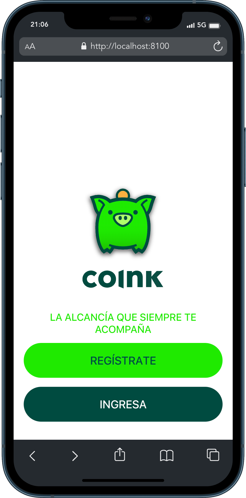

<div align="center">
 

### coink Dev
This project is created for a technical test and was generated with [Angular CLI](https://github.com/angular/angular-cli) version 17.2.0.
</div>

<div align="center">
    <a href="#" target="_blank">
        Preview
    </a>
    <span>&nbsp;✦&nbsp;</span>
    <a href="#-getting-started">
        Getting Started
    </a>
    <span>&nbsp;✦&nbsp;</span>
    <a href="#-commands">
        Commands
    </a>
    <span>&nbsp;✦&nbsp;</span>
    <a href="#-license">
        License
    </a>
    <span>&nbsp;✦&nbsp;</span>
    <a href="https://twitter.com/MiguelA66750525" target="_blank">
        Twitter
    </a>
</div>

<p></p>

<div align="center">


 


</div>

<!-- > [!WARNING]
> This page is not official. The official page is [**premiosesland.com**](https://premiosesland.com/). -->

## 🛠️ Stack

- [**Ionic Framework**](https://ionicframework.com/) - An open source mobile UI toolkit for building modern, high quality cross-platform mobile apps from a single code.
- [**Angular**](https://angular.io/) - The web framework for Angular is a development platform, built on TypeScript.
- [**Typescript**](https://www.typescriptlang.org/) - JavaScript with syntax for types.


## 🚀 Getting Started

1. [Fork](https://github.com/McastilloA/coink/fork) or clone this repository.

```bash
git clone https://github.com/McastilloA/coink.git
```

2. Install the dependencies:

- You can use ***NPM***, which is installed by default when you download [NodeJS](https://nodejs.org/en) .


<!-- ```bash
# Install bun for MacOS, WSL & Linux:
curl -fsSL https://bun.sh/install | bash

# Install bun for Windows:
powershell -c "iwr bun.sh/install.ps1|iex"

# Install with bun:
bun install
``` -->


```bash
# 1. Install npm globally if you don't have it:
npm install -g npm

# 2. Install ionic globally if you don't have it:
npm install -g @ionic/cli
```

- or you can use [pnpm](https://pnpm.io):

```bash
# 1. Install pnpm globally if you don't have it:
npm install -g pnpm

# 2. Install ionic globally if you don't have it:
pnpm install -g @ionic/cli

# Install dependencies:
pnpm install

# (Optional) You can pin the version of pnpm used on 
# your project using the following command:
corepack use pnpm
```

3. Run the development server:

```bash
# Run with ionic:
ionic serve

# Run with pnpm:
pnpm start
```

4. Opent your browser to see the result 🚀


<!-- ### 🤝 Contributing
<a href="https://github.com/McastilloA/sportsBetting/graphs/contributors">
  
</a> -->


## 🤩 Application functionality 

Page **auth** 




Page **register** 


## 🫡 Commands

|     | Command          | Action                                        |
| :-- | :--------------- | :-------------------------------------------- |
| ⚙️  | `pnpm start` | Starts local dev server at `localhost:4200`.  |
| ⚙️  | ` ionic serve`   | Starts local dev server at `localhost:8100`.  |
| ⚙️  | `build`          | The build artifacts will be stored in the `dist/` directory.               |
| ⚙️  | `test`           | execute the unit tests via [Karma](https://karma-runner.github.io).      |
| ⚙️  | `e2e`            | execute the end-to-end tests via a platform of your choice. To use this command, you need to first add a package that implements end-to-end testing capabilities.                          |
| ⚙️  | `preview`        | Preview your build locally, before deploying. |


## 💻 Code scaffolding

Run `ionic generate page page-name` to generate a new component. You can also use `ionic generate directive|pipe|service|class|guard|interface|enum|module`.


## ☎️ Further help

To get more help on the Ionic CLI use `ionic --help` or go check out the [Ionic CLI Overview and Command Reference](https://ionicframework.com/docs/cli) page.


## 🔑 License

[MIT](#) - Created by [**@mclasteVerse**](https://github.com/McastilloA).

## ✅ Por hacer...

- [ ] Mejorar diseño de la página
- [ ] Construir page faltan
