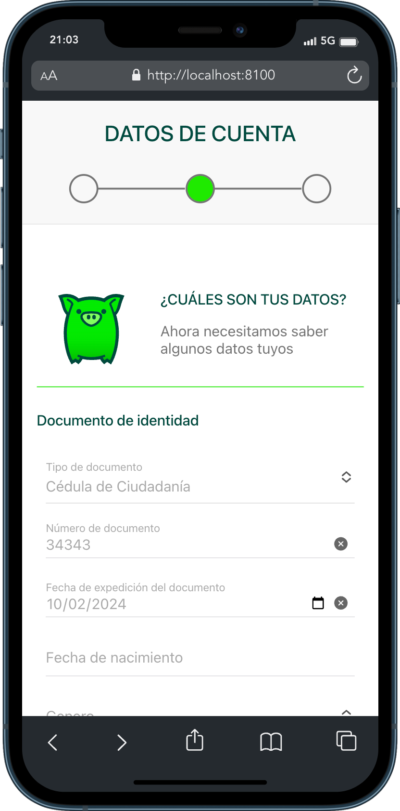

<div align="center">
 

### coink Dev
This project is created for a technical test and was generated with [Ionic CLI](https://github.com/ionic-team/ionic-cli) version 17.2.0.
</div>

<div align="center">
    <a href="#" target="_blank">
        Preview
    </a>
    <span>&nbsp;✦&nbsp;</span>
    <a href="#-getting-started">
        Getting Started
    </a>
    <span>&nbsp;✦&nbsp;</span>
    <a href="#-commands">
        Commands
    </a>
    <span>&nbsp;✦&nbsp;</span>
    <a href="#-license">
        License
    </a>
    <span>&nbsp;✦&nbsp;</span>
    <a href="https://twitter.com/MiguelA66750525" target="_blank">
        Twitter
    </a>
</div>

<p></p>

<div align="center">


 


</div>

> [!WARNING]
> This page is an technical proof. I reserve any liability that may arise from improper handling of this public resource, warning about the possible consequences that could arise as a result of improper handling.

## 🛠️ Stack

- [**Ionic Framework**](https://ionicframework.com/) - An open source development framework for building mobile apps (iOS, Android) and progressive web apps (PWA).
- [**Angular**](https://angular.io/) - An open source framewok developed in TypeScript that is used to build single page applications (SPA), dynamic web applications and mobiles.
- [**Typescript**](https://www.typescriptlang.org/) - JavaScript with syntax for types.
- [**Capacitor**](https://www.typescriptlang.org/) - An open source development framework that allows developers to build native mobile apps for iOS, Android and the web using standard web technologies such as HTML, CSS and JavaScript/TypeScript.


## 🚀 Getting Started

1. [Fork](https://github.com/McastilloA/coink/fork) or clone this repository.

```bash
# Clone repository in local:
git clone https://github.com/McastilloA/coink.git

# Go to folder with MacOS, WSL & Linux:
cd coink

# Go to folder with Windows:
dir coink
```

2. Install the dependencies, which is installed by default when you download [NodeJS](https://nodejs.org/en)

- You can use **npm**:

```bash
# 1. Install npm globally if you don't have it:
npm install -g npm

# 2. Install ionic/cli globally if you don't have it:
npm install -g @ionic/cli
```

- or you can use [pnpm](https://pnpm.io):

```bash
# 1. Install pnpm globally if you don't have it:
npm install -g pnpm

# (Optional) You can pin the version of pnpm used on 
# your project using the following command:
corepack use pnpm

# 2. Install ionic in folder if you don't have it:
pnpm install @ionic/cli

# 3. Install dependencies:
pnpm install
```

3. Run the development server:

```bash
# Run with ionic
ionic serve

# Run with pnpm
pnpm dev
```

4. Open [**http://localhost:8100**](http://localhost:8100/) with your browser to see the result 🚀


<!-- ### 🤝 Contributing
<a href="https://github.com/McastilloA/sportsBetting/graphs/contributors">
  
</a> -->


## 🤩 Application functionality


| Page auth | Register form 1 | Register form 2 | Register form 3 |
| :------------------------------ | :------------------------------ |:------------------------------ | :------------------------------ |
|  |  |  |  |
|  |  |  |  |


## 🫡 Commands

|     | Command          | Action                                        |
| :-- | :--------------- | :-------------------------------------------- |
| ⚙️ | `dev` | Starts local dev server at `localhost:8100`.  |
| ⚙️ | `dev:build` | Perform an Ionic build, which compiles web assets, copy web assets to Capacitor native platform(s), update Capacitor native platform(s) and dependencies Install any discovered Capacitor. |
| ⚙️ | `dev:android` | Open the IDE for your native project [Android Studio](https://developer.android.com/studio) |
| ⚙️ | `dev:ios` | Open the IDE for your native project [Xcode](https://developer.apple.com/xcode/) |
| ⚙️ | `test` | execute the unit tests via [Karma](https://karma-runner.github.io). |
| ⚙️ | `e2e` | execute the end-to-end tests via a platform of your choice. To use this command, you need to first add a package that implements end-to-end testing capabilities. |
| ⚙️ | `preview` | Preview your build locally, before deploying. |


## 💻 Code scaffolding

Run `ionic generate page page-name` to generate a new page. You can also use `ionic generate directive|pipe|service|class|guard|interface|enum|module|etc`.


## ☎️ Further help

To get more help on the Ionic CLI use `ionic help` or go check out the [Ionic CLI Overview and Command Reference](https://ionicframework.com/docs/cli) page.


## 🔑 License

[MIT](#) - Created by [**@mclasteVerse**](https://github.com/McastilloA).

## ✅ Por hacer...

- [ ] Mejorar diseño de la página.
- [ ] Construir page faltantes.
